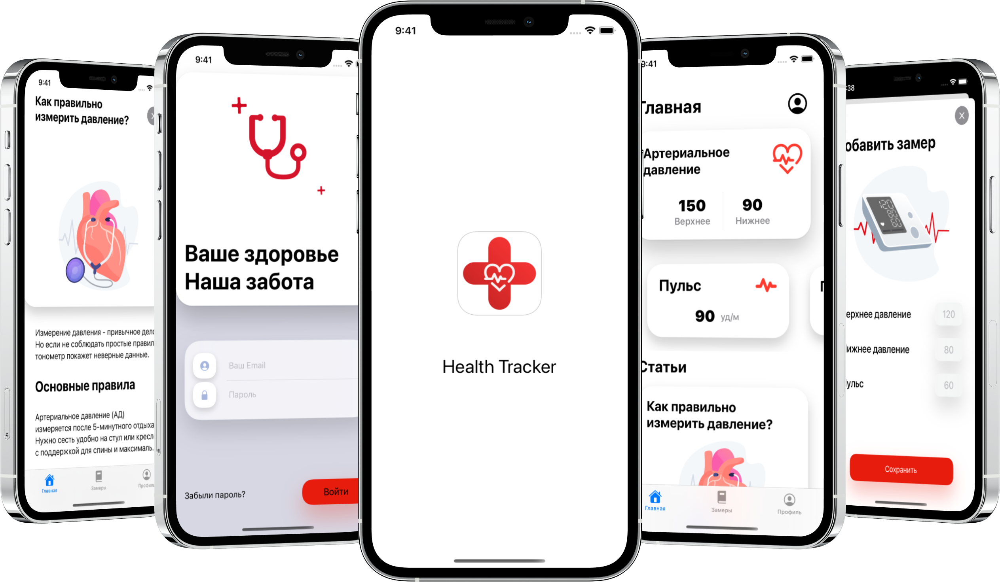
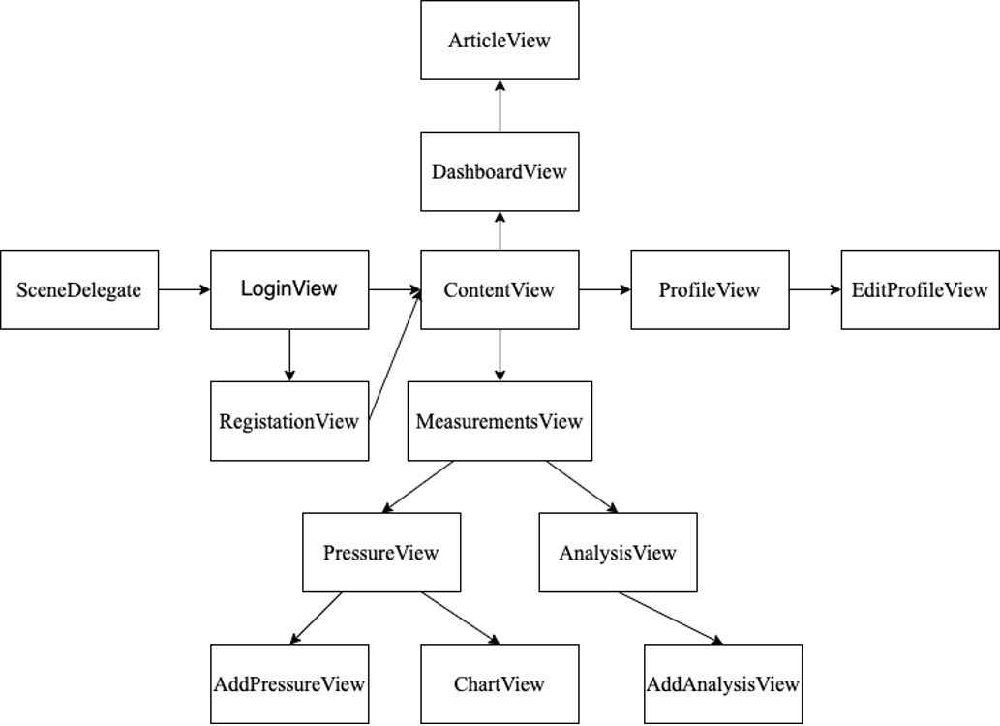

# Health Tracker

    

 <b>Концепт-приложение для учета медицинских данных</b> 

  
  
  
  
  
  

## Описание проекта
 При первом запуске приложения пользователь попадает на экран авторизации, интерфейс которого выполнен в стиле неоморфизма с добавлением Lottie анимаций.
После успешного входа, пользователь перенаправляется на главный экран с карточками последних замеров и рекомендательными статьями по улучшению показателей.
С помощью меню навигации пользователь может попасть на экран с историей замеров артериального давления и результатами анализов. Также на этом экране присутствует кнопка, позволяющая добавлять новые данные. 
 Для организации работы с всеми данными пользователя используется фреймворк CoreData.

 ## Реализовано

- [x] Добавление и отображение истории медицинских данных
- [x] Сохранение данных на устройстве с помощью CoreData
- [x] Полезные статьи для пользователей
- [x] Оценка показателей давления пользователя
- [x] Локализация на английский и русский языки

## UserFlow

    

## Используемые технологии

+ SwiftUI
+ Combine
+ Lottie
+ Swift Package Manager
+ UIKit

## Демонстрация работы приложения

  

